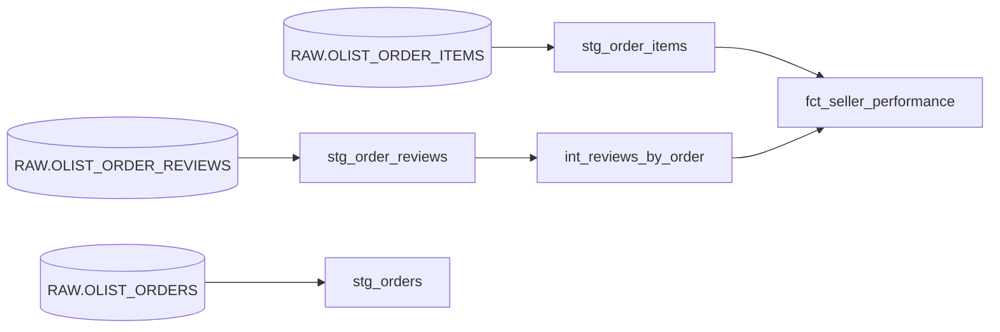

# olist-dbt-snowflake

A dbt project on Snowflake that turns raw Brazilian e-commerce data (the [Olist dataset](https://www.kaggle.com/datasets/olistbr/brazilian-ecommerce)) into a tested, documented **seller performance mart**: one row per seller with revenue, order count, and review metrics.

The project rebuilds a mart originally built with Snowpark, Streams and Tasks as a layered dbt pipeline, and was validated against that original version with zero differences.

## Architecture



| Layer | Model | Grain | Materialization | Rows |
|---|---|---|---|---|
| Staging | `stg_orders` | One row per order | View | 99,441 |
| Staging | `stg_order_items` | One row per item within an order | View | 112,652 |
| Staging | `stg_order_reviews` | One row per review per order | View | 99,224 |
| Intermediate | `int_reviews_by_order` | One row per reviewed order | View | 98,673 |
| Mart | `fct_seller_performance` | One row per seller | Table | 3,095 |

## Tech stack

- **Snowflake** for storage and compute
- **dbt Projects on Snowflake**, developed in Snowflake Workspaces
- **GitHub** for version control, connected to the workspace through a Snowflake API integration

## Key design decisions

**Staging never loses information.** The raw tables were loaded with `INFER_SCHEMA`, which created quoted lowercase column names. Staging models rename them to standard unquoted names and apply a consistent naming convention (`_at` for timestamps), but keep every row and never cast away precision. For example, delivery timestamps stay timestamps rather than being truncated to dates.

**Grain is verified before modeling.** Uniqueness checks showed that no single column identifies a row in `order_items` (the key is `order_id` + `order_item_seq`) or in `order_reviews` (the key is `review_id` + `order_id`). Some orders have several reviews, and some reviews are linked to several orders.

**Fan-out is prevented by aggregating before joining.** Joining item-level rows directly to review rows would duplicate rows and inflate both revenue and review totals. Instead, reviews are aggregated to one row per order (`int_reviews_by_order`), and items are aggregated to one row per order per seller, before the two are joined.

**LEFT JOIN keeps unreviewed revenue.** Items are left-joined to reviews, so revenue from orders without a review is still counted.

**Review metrics are additive.** The mart stores `total_review_score` and `total_review_count` rather than only an average, so they can be correctly re-aggregated. The average is computed once, at the end, with `NULLIF` to avoid division by zero.

## Data quality

13 dbt tests enforce the grain rules discovered during development:

- `unique` and `not_null` on the primary key of every model
- Combined-key uniqueness for `stg_order_items` and `stg_order_reviews`, using a model-level test on a concatenated expression
- `not_null` on `seller_id` in order items, since the mart is grouped by it

Nullable columns, such as delivery timestamps for undelivered orders, are intentionally left untested for nulls.

## Validation

The mart was compared against the original capstone table with a `FULL OUTER JOIN` on `seller_id`, using `IS DISTINCT FROM` so NULL differences would not be missed. The comparison returned **0 mismatched rows**.

## Security

dbt runs as a dedicated **`TRANSFORMER`** role following least privilege:

- **Read-only** access to the `RAW` schema, including future tables
- **Create** access only in the `DBT_DEV` and `DBT_PROD` schemas
- Granted to `SYSADMIN`, so objects created by dbt stay manageable within the role hierarchy

The setup script is in [`RBAC/transformer.sql`](RBAC/transformer.sql). The role was verified by confirming that it can read raw data and build in `DBT_DEV`, and that a write to `RAW` is rejected.

`profiles.yml` contains no credentials, since dbt runs under the Snowflake session.

## Documentation

Every model and its key columns are documented in YAML. With `persist_docs` enabled, the descriptions are also written to Snowflake as table and column comments, so they are visible directly in Snowsight.

## Project structure

```
├── RBAC/
│   └── transformer.sql        # TRANSFORMER role setup
├── models/
│   ├── staging/               # sources.yml, stg_ models and tests
│   ├── intermediate/          # int_reviews_by_order
│   └── marts/                 # fct_seller_performance
├── dbt_project.yml
└── profiles.yml               # dev and prod targets
```

## How to run

1. Open the project in a Snowflake Workspace connected to this repository.
2. Select a profile target: `dev` builds into `ECOMM_DB.DBT_DEV`, and `prod` builds into `ECOMM_DB.DBT_PROD`.
3. Run **Build** to create all models and run all tests in dependency order.

## Known limitations

- **Reviews are per order, not per seller.** When an order contains items from several sellers, each seller receives that order's review. The source data doesn't indicate which seller a review refers to.
- **Revenue excludes freight.** `total_revenue` is the sum of item prices only.
- **Raw column types were inferred.** `INFER_SCHEMA` chose narrow numeric types from the sample data (for example, `price` is `NUMBER(6,2)`), so an unusually large future value would fail at load time.

## Possible next steps

- Add a `stg_sellers` model to enrich the mart with seller city and state
- Make the mart incremental for new orders
- Schedule production builds with a Snowflake Task
- Add CI checks that run tests on every pull request